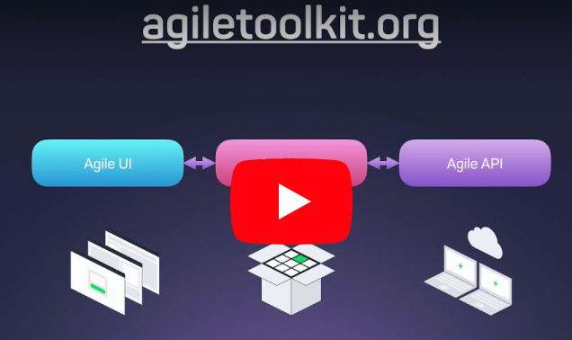
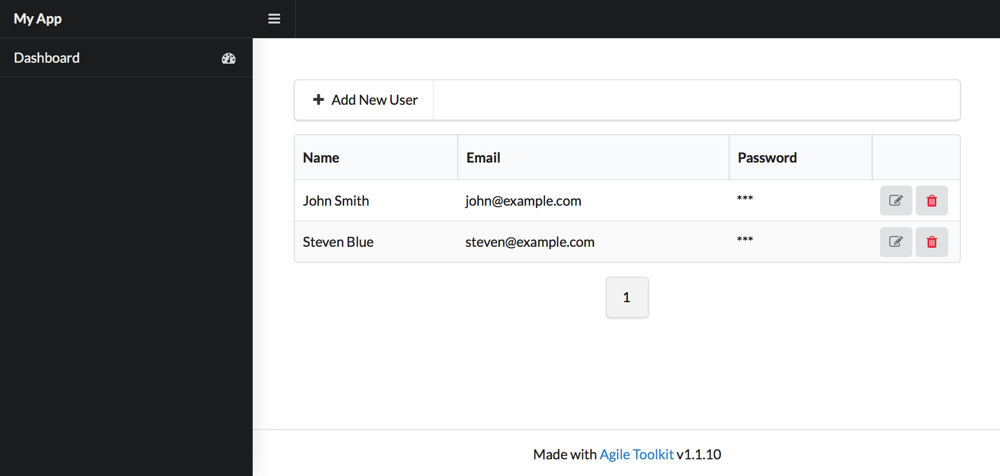

# Agile UI

[](https://travis-ci.org/atk4/ui)
[](https://codeclimate.com/github/atk4/ui)
[](https://styleci.io/repos/68417565)
[](https://codecov.io/gh/atk4/ui)
[](https://packagist.org/packages/atk4/ui)

**Agile UI is a high-level PHP framework for creating User Interfaces and Web Apps**

You might need a CRUD for your "Admin Interface" or perhaps a basic Contact Form connected to [your database in SQL or NoSQL](https://github.com/atk4/data) - Agile UI provides universal and and extensible open-source platform for developing interactive PHP components as well as number of useful components ready to be used out of the box:

``` php
$crud = new \atk4\ui\CRUD();
$crud->setModel(new User($db));
echo $crud->render();
```

## Agile UI is part of [Agile Toolkit](https://agiletoolkit.org/)

[](https://youtu.be/a3imXsrvpVk)

## Setting up and Examples

Install by downloading from from www.agiletoolkit.org or through composer `composer require atk4/ui`.

Components like [CRUD](http://ui.agiletoolkit.org/demos/crud.php), [Form](http://ui.agiletoolkit.org/demos/form3.php) and [Grid](http://ui.agiletoolkit.org/demos/grid.php) are cornerstone for a modern Admin systems. This first example demonstrates how to build a very simple Admin UI with a single CRUD:

``` php
  $app = new \atk4\ui\App('My App');
  $app->initLayout('Admin');
  $db = \atk4\data\Persistence::connect($DSN);
  class User extends \atk4\data\Model {
      public $table = 'user';
      function init() {
          parent::init();

          $this->addField('name');
          $this->addField('email', ['required'=>true]);
          $this->addField('password', ['type'=>'password']);
      }
  }

  $app->add('CRUD')->setModel(new User($db));
```

The new CRUD will be fully **interactive**, will **dynamically reload itself** and support pagination. You can also add more actions, drill-downs, quick-search and dialogs easily.



## Build Powerful Web Apps in pure PHP

PHP is a beautiful and powerful language which we can use to abstract a lot of User Interface implementation. The idea for Agile UI originates from Desktop Toolkits (also used for Mobile apps). The challenge we had to overcome is transparent communication between the browser and a backend.

The next snippet illustrates how you can dynamically load a "[Chart](https://github.com/atk4/chart)" on your dashboard page:

``` php
$loader = $app->add('Loader'); // Will load charts through AJAX

$loader->set(function($page) use ($m) {
  
  $chart = $page->add(new \atk4\chart\BarChart());
  $chart->setModel($m, ['name', 'sales', 'purchase', 'profit']);
});
```

Next time you load the page, you'll see a [loading spinner](http://ui.agiletoolkit.org/demos/loader.php) which will wait for Chart to fetch and prepare data.

## What's new in 1.3

Last release of Agile UI has added some cool features:

-   [Loader](http://ui.agiletoolkit.org/demos/loader.php) which can be nested, carry arguments, integrate with events and more.
-   [Notifyer](http://ui.agiletoolkit.org/demos/notifyer.php) flashes a dynamic success/error message
-   [Modal View](http://ui.agiletoolkit.org/demos/modal2.php) and [Dynamic jsModal](http://ui.agiletoolkit.org/demos/modal.php) are similar but use different techniques for Dynamic Dialogs
-   [AutoComplete](http://ui.agiletoolkit.org/demos/autocomplete.php) is a new Form Field that will automatically traverse [referenced](http://agile-data.readthedocs.io/en/develop/references.html) Model and even open a Modal dialog for adding a new record. Very useful for web apps!
-   [jsSSE](http://ui.agiletoolkit.org/demos/sse.php) is an easy-to-use module for running background jobs in PHP and displaying progress visually through a Progress-bar or Console.

There are loads of minor improvements and a lot of new documentation. If you use 1.2 version, there won't be any breaking changes. For ATK4.x users we recommend to migrate now.

## Add-ons and integrations

Agile UI has been developed from ground-up to be extensible in a whole new way. Each add-on delivers wide range of classes you can incorporate into your application without worrying about UI and Data compatibility.

-   [Charts add-on](https://github.com/atk4/chart) - Modern looking and free charts with [chartJS](http://chartjs.org)
-   [Audit for Models](https://github.com/atk4/audit) - Record all DB operations with Undo/Redo support for Agile Data
-   [Data for Reports](https://github.com/atk4/report) - Implement data aggregation and union models for Agile Data
-   [User Authentication](https://github.com/atk4/login) - User Log-in, Registration and Access Control for Agile UI

Agile UI and Agile Data was built using minimalistic approach and can be integrated into other frameworks and apps. Here are some of the connectors:

-   [Laravel Agile Data](https://github.com/atk4/laravel-ad) - ServiceProvider for Agile Data
-   .. more connectors wanted. If you are working to integrate Agile UI or Agile Data, please list it here (even if incomplete).

## Things you can Build in Agile UI:

Agile UI comes with a lot of ready-to-use components, but they are also very extensible:

-   application layouts (e.g. Admin and Centered)
-   form fields (e.g. CheckBox and Calendar)
-   table columns (e.g. Status and Links)
-   action-column actions (e.g. Button, Expander)
-   data types (e.g. money, date)
-   persistences (APIs and Services)
-   models (e.g. User, Country)

## Bundled and Planned components

Agile UI comes with many built-in components:

| Component                                | Description                              | Introduced |
| ---------------------------------------- | ---------------------------------------- | ---------- |
| [View](http://ui.agiletoolkit.org/demos/view.php) | Template, Render Tree and various patterns | 0.1        |
| [Button](http://ui.agiletoolkit.org/demos/button.php) | Button in various variations including icons, labels, styles and tags | 0.1        |
| [Input](http://ui.agiletoolkit.org/demos/field.php) | Decoration of input fields, integration with buttons. | 0.2        |
| [JS](http://ui.agiletoolkit.org/demos/button2.php) | Assign JS events and abstraction of PHP callbacks. | 0.2        |
| [Header](http://ui.agiletoolkit.org/demos/header.php) | Simple view for header.                  | 0.3        |
| [Menu](http://ui.agiletoolkit.org/demos/layout2.php) | Horizontal and vertical multi-dimensional menus with icons. | 0.4        |
| [Form](http://ui.agiletoolkit.org/demos/form.php) | Validation, Interactivity, Feedback, Layouts, Field types. | 0.4        |
| [Layouts](http://ui.agiletoolkit.org/demos/layouts.php) | Admin, Centered.                         | 0.4        |
| [Table](http://ui.agiletoolkit.org/demos/table.php) | Formatting, Columns, Status, Link, Template, Delete. | 1.0        |
| [Grid](http://ui.agiletoolkit.org/demos/grid.php) | Toolbar, Paginator, Quick-search, Expander, Actions. | 1.1        |
| [Message](http://ui.agiletoolkit.org/demos/message.php) | Such as "Info", "Error", "Warning" or "Tip" for easy use. | 1.1        |
| [Modal](https://ui.agiletoolkit.org/demos/modal.php) | Modal dialog with dynamically loaded content. | 1.1        |
| [Reloading](http://ui.agiletoolkit.org/demos/reloading.php) | Dynamically re-render part of the UI.    | 1.1        |
| [Actions](https://ui.agiletoolkit.org/demos/reloading.php) | Extended buttons with various interactions | 1.1        |
| [CRUD](http://ui.agiletoolkit.org/demos/crud.php) | Create, List, Edit and Delete records (based on Advanced Grid) | 1.1        |
| [Tabs](https://ui.agiletoolkit.org/demos/tabs.php) | 4 Responsive: Admin, Centered, Site, Wide. | 1.2        |
| [Loader](http://ui.agiletoolkit.org/demos/loader.php) | Dynamically load itself and contained components inside. | 1.3        |
| [Modal View](http://ui.agiletoolkit.org/demos/modal2.php) | Open/Load contained components in a dialog. | 1.3        |
| Breadcrumb                               | Push links to pages for navigation. Wizard. | 1.4 *      |
| ProgressBar                              | Interactive display of a multi-step PHP code execution progress | 1.4 *      |
| Console                                  | Execute server/shell commands and display progress live | 1.4 *      |
| Items, Cards                             | Responsive Items and Card implementaiton. | 1.4 *      |
| Wizard                                   | Multi-step, wizard with temporary data storing. | 1.5 *      |
|                                          |                                          |            |

-- * Component is not implemented yet.

All bundled components are free and licensed under MIT license. They are installed together with Agile UI.

External and 3rd party components may be subject to different licensing terms.

## Getting Started

Although we support  `composer require atk4/ui` for your first application we recommend you to:

1.  Go to www.agiletoolkit.org and click download.
2.  Follow instructions to run the "sample" app.
3.  Blank repo is bundled, so `git add . && git commit`
4.  Deploy to cloud - Heroku, Google App Engine or any Docker environment through `git push`.

### Simple Hello World component

Semantic of Agile UI is really simple:

``` php
require "vendor/autoload.php";

$app = new \atk4\ui\App('My First App');
$app->initLayout('Centered');

$app->add('HelloWorld');
```

That's right! We have [HelloWorld an LoremIpsum components](https://github.com/atk4/ui/blob/develop/src/HelloWorld.php)!! Next is a code for a more sophisticated admin system:

``` php
require "vendor/autoload.php";

$db = new \atk4\data\Persistence_SQL('mysql:dbname=test;host=localhost','root','root');
$app = new \atk4\ui\App('My Second App');
$app->initLayout('Admin');

$m_comp = $app->layout->menu->addMenu(['Layouts', 'icon'=>'puzzle']);
$m_comp->addItem('Centered', 'centered');
$m_comp->addItem('Admin', 'admin');

$m_comp = $app->layout->menu->addMenu(['Component Demo', 'icon'=>'puzzle']);
$m_form = $m_comp->addMenu('Forms');
$m_form->addItem('Form Elements', 'from');
$m_form->addItem('Form Layouts', 'layout');
$m_comp->addItem('CRUD', 'crud');

$app->layout->leftMenu->addItem(['Home', 'icon'=>'home']);
$app->layout->leftMenu->addItem(['Topics', 'icon'=>'block layout']);
$app->layout->leftMenu->addItem(['Friends', 'icon'=>'smile']);
$app->layout->leftMenu->addItem(['Historty', 'icon'=>'calendar']);
$app->layout->leftMenu->addItem(['Settings', 'icon'=>'cogs']);

$f = $app->layout->add(new \atk4\ui\Form(['segment']));

$f_group = $f->addGroup('Name');
$f_group->addField('first_name', ['width'=>'eight']);
$f_group->addField('middle_name', ['width'=>'three']);
$f_group->addField('last_name', ['width'=>'five']);

$f_group = $f->addGroup('Address');
$f_group->addField('address', ['width'=>'twelve']);
$f_group->addField('zip', ['Post Code', 'width'=>'four']);

$f->onSubmit(function ($f) {
    $errors = [];

    foreach (['first_name', 'last_name', 'address'] as $field) {
        if (!$f->model[$field]) {
            $errors[] = $f->error($field, 'Field '.$field.' is mandatory');
        }
    }

    return $errors ?: $f->success('No more errors', 'so we have saved everything into the database');
});
```

We have many examples in the [demo folder](https://github.com/atk4/ui/tree/develop/demos).

### Single component render

Agile UI fits into your framework of choice. That's why we didn't bother adding our own Router and didn't want to give you another REST framework. Enjoy Agile UI in any environment - Wordpress, Laravel, Yii or plain PHP. If you need to render only one component without boilerplate HTML, use render() method.

``` HTML
 <head>
    <link rel="stylesheet" type="text/css" href="http://semantic-ui.com/dist/semantic.css">
    <script src="https://code.jquery.com/jquery-3.1.1.js"></script>
    <script src="http://semantic-ui.com/dist/semantic.js"></script>
</head>
<body>
  
<?php 
  $component = new \atk4\ui\HelloWorld();
  echo $component->render();
?>
 
</body>
```

## Documentation

Because Agile UI makes active use of Agile Core and Agile data, I'm linking all related documentation here:

-   [Agile UI Documentation](http://agile-ui.readthedocs.io)
-   [Agile Data Documentation](http://agile-data.readthedocs.io)
-   [Agile Core Documentation](http://agile-core.readthedocs.io)

If anything is unclear or you want to get in touch with other awesome people who use Agile UI:

-   [Forum](https://forum.agiletoolkit.org) - use label Agile UI or Agile Data.
-   [Developer Gitter Live Chat](https://gitter.im/atk4/atk4) - if you wish to say Thanks to those who created Agile UI (for free!)

 ## Scope and Goals of Agile UI

What makes this UI toolkit stand out from the others UI libraries is a commitment to bring rich and interractive web components that can be used for web applications without any custom-HTML/JS. Additionally, Agile UI provides a very controlled and consistent ways to develop "add-ons" that include visual components and other re-usable elements.

To achieve its goal, Agile UI offers both the tools for creating components and a wide selection of built-in components that provides the "minimum standard Web UI":


## Q&A

**Q: HTML-generating frameworks are lame and inefficient, real coders prefer to manually write HTML/CSS in Twig or Smarty.**

Agile UI focuses on "out-of-the-box" experience and development efficiency. Our ambition is to make PHP usable for those who are not familiar with HTML/CSS/JS. In fact, we are working with some educational partners and have "education course" available for secondary school students that teaches how to build Data-drivven Web Apps in just 1 year.

**Q: What about Angular-JS, VueJS and all the other JS frameworks?**

You should look into [Agile API](https://github.com/atk4/api), which provides binding between Agile Data and your front-end framework.

**Q: I prefer Bootstrap CSS (or other CSS) over Semantic UI**

We considered several CSS frameworks.  We decided to focus on Semantic UI implementation as our primary framework for the following reasons:

-   Great theming and customisation variables
-   Clear patterns in class definitions
-   Extensive selection of core components
-   jQuery and JavaScript API integrations

Bearing in mind the popularity of Bootstrap CSS, we plan to build extension for it sometime soon.

## Credits and License

Agile UI, Data and API are projects we develop in our free time and offer you free of charge under terms of MIT license. If you wish to say thanks to our core team or take part in the project, please contact us through our chat on Gitter.


[](https://gitter.im/atk4/atk4?utm_source=badge&utm_medium=badge&utm_campaign=pr-badge&utm_content=badge)
